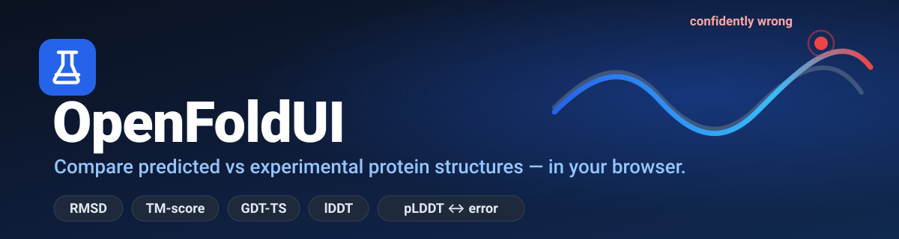

<div align="center">



<br/>

### The AlphaFold companion — inspect, validate, and compare AlphaFold predictions, entirely in your browser.

**Inspect** any AlphaFold model (confidence, disorder, PAE, domains). **Validate** it against the real
experimental structure (RMSD, TM-score, GDT-TS, lDDT). **See where it was _confidently wrong_.**

[](#testing)
[](#architecture)
[]()
[]()
[]()
[](LICENSE)

</div>

---

OpenFoldUI is a companion to **AlphaFold**. Point it at any protein and it will:

- **Inspect** the AlphaFold model on its own — pLDDT confidence, predicted disordered regions, PAE, and domains — for *any* of the 200M+ proteins, no experimental structure required.
- **Compare** it against the best **experimental** structure of the same protein — Kabsch superposition, **RMSD · TM-score · GDT-TS · lDDT**, and the scientific payload: the **correlation between AlphaFold's confidence (pLDDT) and its actual per-residue error**.
- **Fold** a raw sequence (ESMFold, or your own AlphaFold/ColabFold endpoint) and feed it straight into a comparison.

Everything runs in your browser. There is no backend.

> The headline question it answers: *where was the model **confident but wrong*** —
> high pLDDT yet far from the real structure.

## Quick start

```bash
npm install
npm run dev          # http://localhost:5173
```

Type a protein name or UniProt accession (e.g. `p53` or `P04637`), click an example,
**upload your own** model + reference, or **fold a sequence**. See the metrics, the
calibration charts, the per-residue tracks, and a 3D overlay you can recolour.

Run the engine headlessly on real data (no browser):

```bash
npx vite-node scripts/validate.ts                # p53 (P04637) vs 2OCJ
npx vite-node scripts/validate.ts P24941 6q4g    # any UNIPROT [PDB]
```

## What it does

**Core comparison**
- AlphaFold-DB lookup, best-experimental-structure selection (X-ray > coverage > resolution), SIFTS numbering done right (per-atom UniProt numbers from PDBe updated mmCIF).
- From-scratch engine: Kabsch superposition, **RMSD · TM-score · GDT-TS · lDDT**, per-residue deviation, and **Spearman(pLDDT, error)** — validated against canonical **TM-align** (WASM) to ~0.001 TM-score.
- Mol\* 3D overlay (deviation / pLDDT colouring, bound-ligand display, PNG screenshot).

**Deeper science**
- **lDDT** (superposition-free) with the correct **pLDDT-vs-lDDT calibration** plot.
- **PAE domain decomposition** + per-domain RMSD (catches "domains right, orientation wrong").
- **Distance-difference matrix** (contact-map comparison) for topological errors.
- **Secondary-structure** breakdown, **binding-site** impact, **B-factor vs deviation**, **divergent regions**, workspace-wide **confidence calibration**.
- **UniProt feature track** (domains, sites, modifications, variants); **multi-state** comparison ("which state did AlphaFold predict?").

**Bring your own data**
- Upload `.pdb`/`.cif` models + references; align by author numbering, UniProt, or **sequence** (Needleman–Wunsch).
- **Fold a sequence** with a persistent queue — ESMFold by default, or point it at your own AlphaFold/ColabFold endpoint.
- **Batch** mode over many IDs with live distributions; CSV/column import.

**A real workspace**
- IndexedDB history with **favorites, tags, projects, notes, annotations**; a dashboard with stats, sparklines, and a tag/project filter.
- Command palette (⌘K), keyboard shortcuts, onboarding tour, undo, jump-back, dark mode, installable **PWA**.
- Export everything: Excel/CSV, **per-comparison reports (HTML→PDF)**, a **paper bundle** (Markdown + SVG figures + BibTeX), replication **logs**, JSON backup, and a full **.zip**.

## Architecture

Pure, headless engine at the core; everything else is a thin layer around it.

| Layer | Path | Notes |
| --- | --- | --- |
| Engine | `src/engine/` | Pure math + parsing. No DOM, no network, no Mol\*. Fully unit-tested. |
| API | `src/api/` | One typed module per source (UniProt, PDBe, RCSB, AlphaFold) + `pipeline.ts`. |
| Viewer | `src/viewer/` | Lazy, error-boundaried Mol\* wrapper. |
| Charts | `src/charts/` | Observable Plot. |
| Workspace | `src/workspace/` | IndexedDB persistence, export, reports, paper bundle. |
| Batch / Fold / Search | `src/batch/`, `src/fold/`, `src/search/` | Bounded-concurrency pools; ESMFold; Foldseek. |
| UI shell | `src/ui/` | Sidebar, top bar, command palette, toasts, onboarding. |

`SPEC.md` is the source of truth · `CLAUDE.md` the summary · `BUILD_PLAN.md` the status · `docs/PHASE0.md` the de-risking + real-data validation.

## Tech stack

React · TypeScript (strict) · Vite · Vitest · Mol\* · Observable Plot · `ml-matrix` ·
`idb` · `tmalign-wasm` · ESMFold/Foldseek (best-effort) — **no backend, no tracking,
no accounts.**

## Testing

```bash
npm test          # 198 unit tests (engine, api, workspace, batch, fold, search)
npm run typecheck # tsc --noEmit
npm run build     # production build (Mol* + tmalign are lazy chunks)
```

The from-scratch engine is verified two ways: known-answer unit tests for every
metric, and a real-data run (p53/2OCJ → RMSD 0.51 Å, TM 0.99, GDT 0.99) that agrees
with TM-align.

## Commands

| Command | What it does |
| --- | --- |
| `npm run dev` | Dev server — the full app |
| `npm test` | Vitest suite (network-free) |
| `npm run typecheck` | `tsc --noEmit` |
| `npm run build` | Production build to `dist/` |
| `npx vite-node scripts/validate.ts [UNIPROT] [PDB]` | Headless real-data validation |

## License

[MIT](LICENSE)
